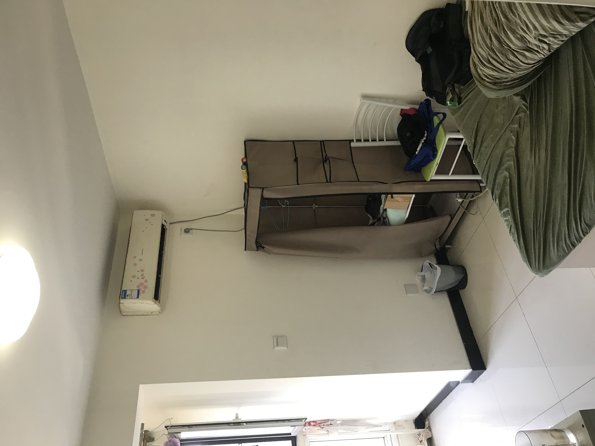
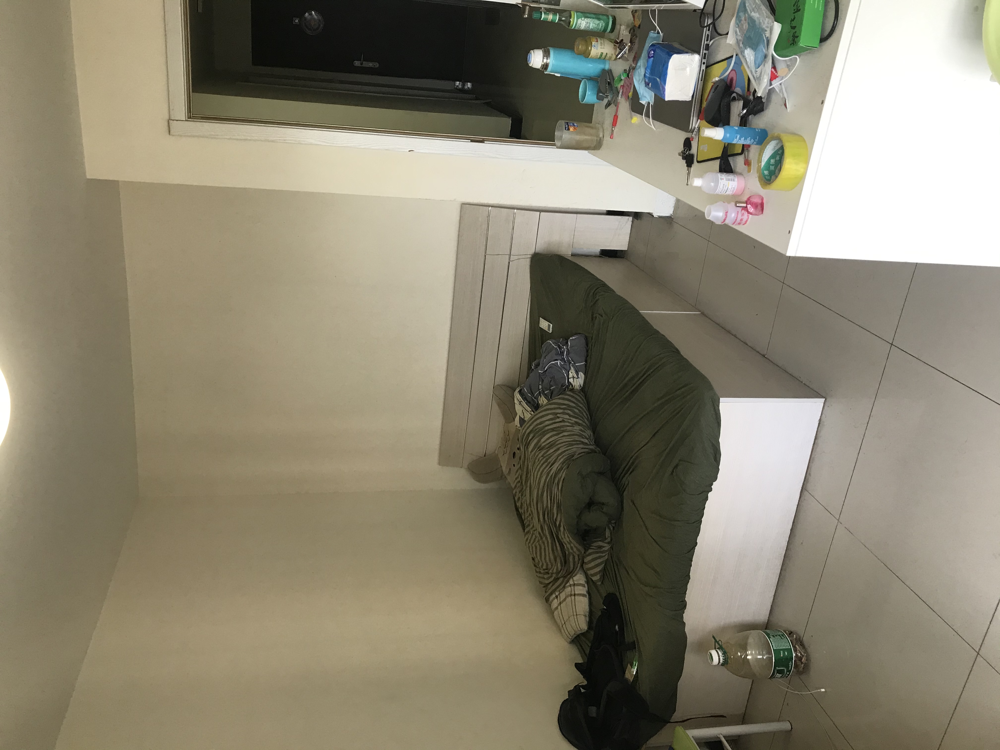
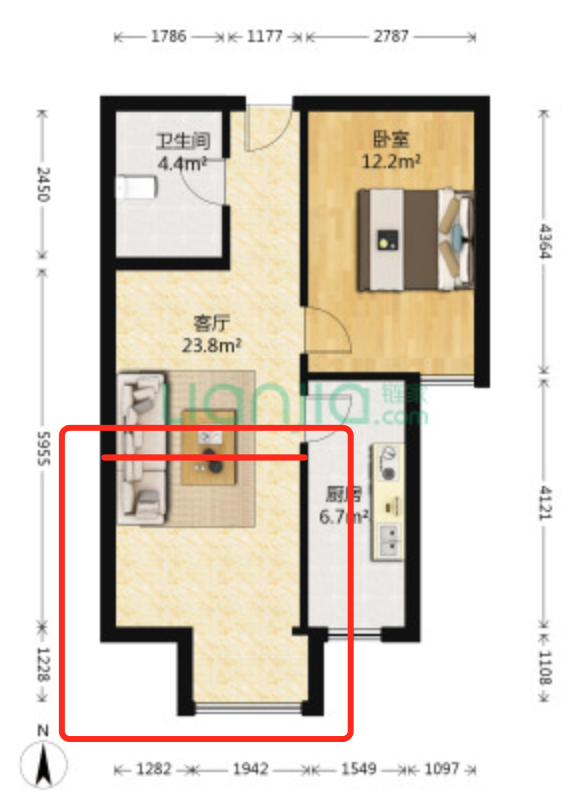

# [招室友] 金域华府

现在的室友换工作离开北京，八月底走；不太想搬家，所以招室友

基本情况：
+ 金域华府小区，和房东直租的，当前合同到明年3月底；
+ 万科物业，小区环境特别好，万科物业，安保很严格，晚上很多小区内散步的
+ 距离公司步行距离不到2km，或者西门坐963到软件园广场站
+ 房东很好打交道，到时候可以续租；
+ 有公交到西二旗地铁站、上地站等，周围有昌发展，超市有永辉、日日生鲜、华润等
+ 水、电、燃气、网、取暖、物业等费用均摊，其中物业、取暖大概2000/年
+ 房租部分，押一付三，2700/月
+ 房子是房东一居室改的二居室，招租的房间是改的那一间
+ 房间大概15平米，南向，大落地窗

期望室友：
+ 尽量不吸烟
+ 保持公共区域卫生

房间照片：

户型图：

